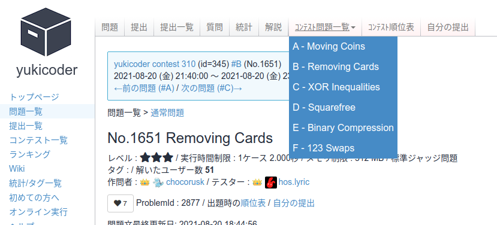
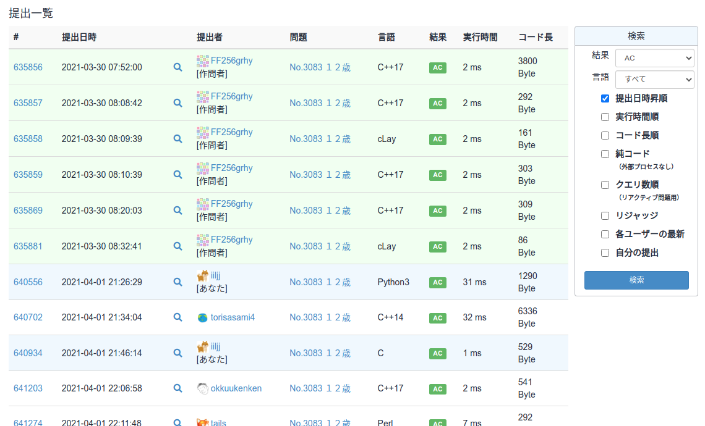
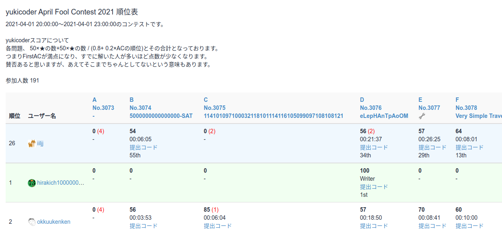
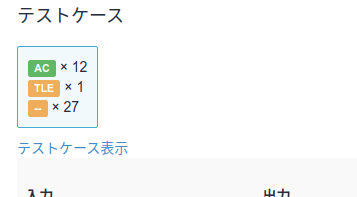

comfortable-yukicoder
=====

## 概要

[yukicoder](https://yukicoder.me/) にいくつかの機能を追加する userscript です．主に動線を増やします．

## 主な機能

- 問題ページ・提出結果ページなどへのページ上部タブ追加
- 前の問題・次の問題への動線を追加
- 作問者・テスター・自分の提出をハイライト
- 順位表で自分を一番上にも表示
- テストケースの AC/WA/TLE などの合計個数を表示

## Greasy Fork 配布ページ

- [atcoder\-standings\-difficulty\-analyzer](https://greasyfork.org/ja/scripts/419541-atcoder-standings-difficulty-analyzer)

## 使用方法

Tampermonkey 等で読み込んで使用してください．

## 更新履歴

- 1.0.0 (2021-08-21)
  - 初版
- 1.1.0 (2021-12-07)
  - 「スコア順」ページにて作問者・テスター・自分自身の行をハイライトする機能を追加

## 連絡先

- [iilj \(iilj\)](https://github.com/iilj)
